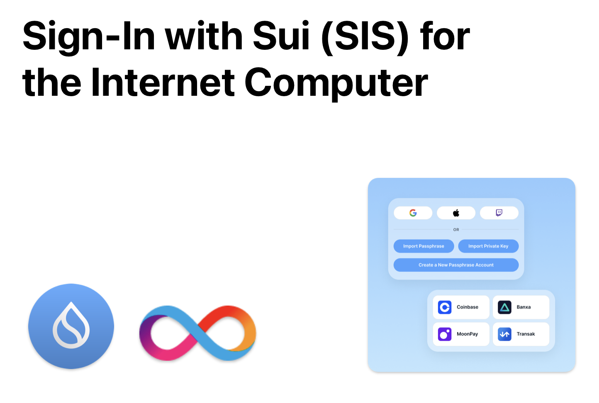

[![Crate][crate-image]][crate-link] [![Docs][docs-image]][docs-link]

`ic_sis` is a Rust library that facilitates the integration of Sui wallet-based authentication with applications on the Internet Computer (ICP) platform. The library provides all necessary tools for integrating Sign-In with Sui (SIS) into ICP canisters, from generating SIS messages to creating delegate identities.

`ic_sis` enhances the interoperability between Sui and the Internet Computer platform, enabling developers to build applications that leverage the strengths of both platforms.

## Key Features

- **Sui Wallet Sign-In**: Enables Sui wallet sign-in for ICP applications. Sign in with any Sui wallet to generate an ICP identity and session.
- **Multiple Signature Schemes**: Supports various Sui signature schemes including Pure Ed25519, ECDSA Secp256k1, and ECDSA Secp256r1.
- **Session Identity Uniqueness**: Ensures that session identities are specific to each application's context, preventing cross-app identity misuse.
- **Consistent Principal Generation**: Guarantees that logging in with a Sui wallet consistently produces the same Principal, irrespective of the client used.
- **Direct Sui Address to Principal Mapping**: Creates a one-to-one correlation between Sui addresses and Principals within the scope of the current application.
- **Timebound Sessions**: Allows developers to set expiration times for sessions, enhancing security and control.
- **Intent Signing Support**: Implements Sui's intent signing protocol for secure transaction authentication.

## Table of Contents

- [Prebuilt `ic_sis_provider` canister](#prebuilt-ic_sis_provider-canister)
- [The SIS Standard](#the-sis-standard)
- [Login flow](#login-flow)
  - [SIS canister interface](#sis-canister-interface)
  - [`sis_prepare_login`](#sis_prepare_login)
  - [`sis_login`](#sis_login)
  - [`sis_get_delegation`](#sis_get_delegation)
- [Updates](#updates)
- [Contributing](#contributing)
- [License](#license)

## Prebuilt `ic_sis_provider` canister

While the `ic_sis` library can be integrated with any Rust-based ICP project, using the pre-built `ic_sis_provider` canister is the easiest way to integrate Sui wallet authentication into your application.

The canister is designed as a plug-and-play solution for developers, enabling easy integration into existing ICP applications with minimal coding requirements. By adding the pre-built `ic_sis_provider` canister to the `dfx.json` of an ICP project, developers can quickly enable Sui wallet-based authentication for their applications. The canister simplifies the authentication flow by managing the creation and verification of SIS messages and handling user session management.

## The SIS Standard

Sign-In with Sui (SIS) is a protocol for off-chain authentication of Sui accounts. The protocol is designed to enable Sui wallet-based authentication for applications on other platforms, such as the Internet Computer. At the core of the protocol is the SIS message, which is a signed message that contains the Sui address of the user and additional metadata. The SIS message is signed by the user's Sui wallet using one of the supported signature schemes and then sent to the application's backend. The backend verifies the signature and Sui address and then creates a session for the user.

The SIS protocol leverages Sui's multiple signature schemes, including:
- Pure Ed25519 (flag 0x00)
- ECDSA Secp256k1 (flag 0x01)
- ECDSA Secp256r1 (flag 0x02)

Each signature includes a scheme flag, the signature bytes, and the public key bytes, all properly formatted according to Sui's standards.

## Login flow

Creating a delegate identity using `ic_sis` is a three-step process:

1. **Prepare login** - Generate SIS message and nonce
2. **Login** - Verify signature and create session  
3. **Get delegation** - Retrieve delegation for authenticated session

An implementing canister is free to implement these steps in any way it sees fit. It is recommended though that implementing canisters follow the login flow described below and implement the SIS canister interface.

The login flow is illustrated in the following diagram:

```text
                                ┌────────┐                                        ┌────────┐                              ┌────────┐
                                │Frontend│                                        │Canister│                              │SuiWallet│
   User                         └───┬────┘                                        └───┬────┘                              └────┬────┘
    │      Push login button       ┌┴┐                                                │                                        │
    │ ────────────────────────────>│ │                                                │                                        │
    │                              │ │                                                │                                        │
    │                              │ │          sis_prepare_login(sui_address)       ┌┴┐                                       │
    │                              │ │ ─────────────────────────────────────────────>│ │                                       │
    │                              │ │                                               └┬┘                                       │
    │                              │ │                OK, sis_message                 │                                        │
    │                              │ │ <─ ─ ─ ─ ─ ─ ─ ─ ─ ─ ─ ─ ─ ─ ─ ─ ─ ─ ─ ─ ─ ─ ─ ─                                        │
    │                              │ │                                                │                                        │
    │                              │ │                                    Sign sis_message                                    ┌┴┐
    │                              │ │ ──────────────────────────────────────────────────────────────────────────────────────>│ │
    │                              │ │                                                │                                       │ │
    │                              │ │                  Ask user to confirm           │                                       │ │
    │ <───────────────────────────────────────────────────────────────────────────────────────────────────────────────────────│ │
    │                              │ │                                                │                                       │ │
    │                              │ │                          OK                    │                                       │ │
    │  ─ ─ ─ ─ ─ ─ ─ ─ ─ ─ ─ ─ ─ ─ ─ ─ ─ ─ ─ ─ ─ ─ ─ ─ ─ ─ ─ ─ ─ ─ ─ ─ ─ ─ ─ ─ ─ ─ ─ ─ ─ ─ ─ ─ ─ ─ ─ ─ ─ ─ ─ ─ ─ ─ ─ ─ ─ ─ ─ >│ │
    │                              │ │                                                │                                       └┬┘
    │                              │ │                                      OK, signature                                      │
    │                              │ │ <─ ─ ─ ─ ─ ─ ─ ─ ─ ─ ─ ─ ─ ─ ─ ─ ─ ─ ─ ─ ─ ─ ─ ─ ─ ─ ─ ─ ─ ─ ─ ─ ─ ─ ─ ─ ─ ─ ─ ─ ─ ─ ─ ─
    │                              │ │                                                │                                        │
    │                              │ │────┐                                           │                                        │
    │                              │ │    │ Generate random session_identity          │                                        │
    │                              │ │<───┘                                           │                                        │
    │                              │ │                                                │                                        │
    │                              │ │             sis_login(sui_address,             │                                        │
    │                              │ │          signature, session_identity)         ┌┴┐                                       │
    │                              │ │ ─────────────────────────────────────────────>│ │                                       │
    │                              │ │                                               │ │                                       │
    │                              │ │                                               │ │────┐                                  │
    │                              │ │                                               │ │    │ Verify signature with intent     │
    │                              │ │                                               │ │<───┘                                  │
    │                              │ │                                               │ │                                       │
    │                              │ │                                               │ │────┐                                  │
    │                              │ │                                               │ │    │ Prepare delegation               │
    │                              │ │                                               │ │<───┘                                  │
    │                              │ │                                               └┬┘                                       │
    │                              │ │     OK, canister_pubkey, delegation_expires    │                                        │
    │                              │ │ <─ ─ ─ ─ ─ ─ ─ ─ ─ ─ ─ ─ ─ ─ ─ ─ ─ ─ ─ ─ ─ ─ ─ ─                                        │
    │                              │ │                                                │                                        │
    │                              │ │     sis_get_delegation(delegation_expires)    ┌┴┐                                       │
    │                              │ │ ─────────────────────────────────────────────>│ │                                       │
    │                              │ │                                               └┬┘                                       │
    │                              │ │                 OK, delegation                 │                                        │
    │                              │ │ <─ ─ ─ ─ ─ ─ ─ ─ ─ ─ ─ ─ ─ ─ ─ ─ ─ ─ ─ ─ ─ ─ ─ ─                                        │
    │                              │ │                                                │                                        │
    │                              │ │────┐                                           │                                        │
    │                              │ │    │ Create delegation identity                │                                        │
    │                              │ │<───┘                                           │                                        │
    │                              └┬┘                                                │                                        │
    │ OK, logged in with            │                                                 │                                        │
    │ Principal niuiu-iuhbi...-oiu  │                                                 │                                        │
    │ <─ ─ ─ ─ ─ ─ ─ ─ ─ ─ ─ ─ ─ ─ ─                                                  │                                        │
  User                          ┌───┴────┐                                        ┌───┴────┐                              ┌────┴────┐
                                │Frontend│                                        │Canister│                              │SuiWallet│
                                └────────┘                                        └────────┘                              └─────────┘
```

### SIS canister interface

#### `sis_prepare_login`

Initiates the login flow by creating a SIS message:

```rust
pub fn prepare_login(address: &SuiAddress) -> Result
```

- **Input**: User's Sui address
- **Output**: SIS message (for signing) + nonce
- **Purpose**: Frontend uses this to prompt wallet signature

#### `sis_login`

Verifies the signed message and creates a session:

```rust
pub fn login(
    signature: &SuiSignature,
    address: &SuiAddress, 
    session_key: ByteBuf,
    signature_map: &mut SignatureMap,
    canister_id: &Principal,
    nonce: &str,
) -> Result
```

- **Input**: Signature, address, session key, nonce
- **Output**: Session details with expiration and public key
- **Purpose**: Validates signature using Sui's intent verification

#### `sis_get_delegation`

Retrieves the delegation for authenticated access:

- **Implementation**: Uses `generate_seed`, `create_delegation`, `witness`, etc.
- **Purpose**: Creates ICP delegation for canister calls

## 📚 API Reference

### Core Functions

```rust
// Signature verification with BCS and intent signing
pub fn verify_sui_signature(
    blake2b_hash: &[u8],
    signature: &SuiSignature,
) -> Result;

// Intent hash creation for authentication
pub fn create_auth_intent_hash(message: &[u8]) -> Result<Vec, SuiError>;

// Address derivation from public key
pub fn derive_sui_address_from_public_key(
    scheme: u8, 
    public_key: &[u8]
) -> Result;
```

### Message Creation

```rust
// Create SIS message with BCS serialization
let message = SisMessage::new(&address, &nonce);

// Get BCS bytes for signing
let bcs_bytes = message.to_sign_bytes();

// Create intent hash for verification
let intent_hash = message.create_intent_message();
```

## 💡 Examples

### Basic Usage

```rust
use ic_sis::{
    settings::SettingsBuilder,
    sui::{SuiAddress, SuiSignature},
    login::{prepare_login, login},
    init,
};

// Initialize library
let settings = SettingsBuilder::new(
    "myapp.com",
    "https://myapp.com", 
    "unique_salt"
).network("mainnet").build()?;

init(settings)?;

// 1. Prepare login
let address = SuiAddress::new("0x1234...")?;
let (sis_message, nonce) = prepare_login(&address)?;

// 2. User signs message with wallet (frontend)
// let signature = wallet.sign(sis_message.to_human_readable());

// 3. Verify and login
let signature = SuiSignature::from_hex("0x00...")?;
let login_details = login(
    &signature,
    &address,
    session_key,
    &mut signature_map,
    &canister_id,
    &nonce,
)?;
```

### BCS Serialization

```rust
// Create message and serialize with BCS
let message = SisMessage::new(&address, &nonce);

// BCS serialization (recommended)
let bcs_bytes = message.to_sign_bytes();

// Validate BCS compatibility
message.validate_bcs_serialization()?;

// Compare with JSON (debugging)
let (bcs, json) = message.compare_serializations();
println!("BCS: {} bytes, JSON: {} bytes", bcs.len(), json.len());
```

## 📝 Updates

See the [CHANGELOG](CHANGELOG.md) for details on updates.

## 🤝 Contributing

Contributions are welcome! Please feel free to submit pull requests or open issues to propose changes or report bugs.

### Development

```bash
cargo test

cargo test -- --nocapture

cargo fmt --check

cargo clippy -- -D warnings
```

## 📄 License

This project is licensed under the MIT License. See the [LICENSE](LICENSE) file for more details.

---

## 🔗 Links

- **Documentation**: [docs.rs/ic_sis](https://docs.rs/ic_sis)
- **Repository**: [github.com/Talentum-id/ic_sis](https://github.com/Talentum-id/ic_sis)
- **Crate**: [crates.io/crates/ic_sis](https://crates.io/crates/ic_sis)

[crate-image]: https://img.shields.io/crates/v/ic_sis.svg
[crate-link]: https://crates.io/crates/ic_sis
[docs-image]: https://docs.rs/ic_sis/badge.svg
[docs-link]: https://docs.rs/ic_sis/